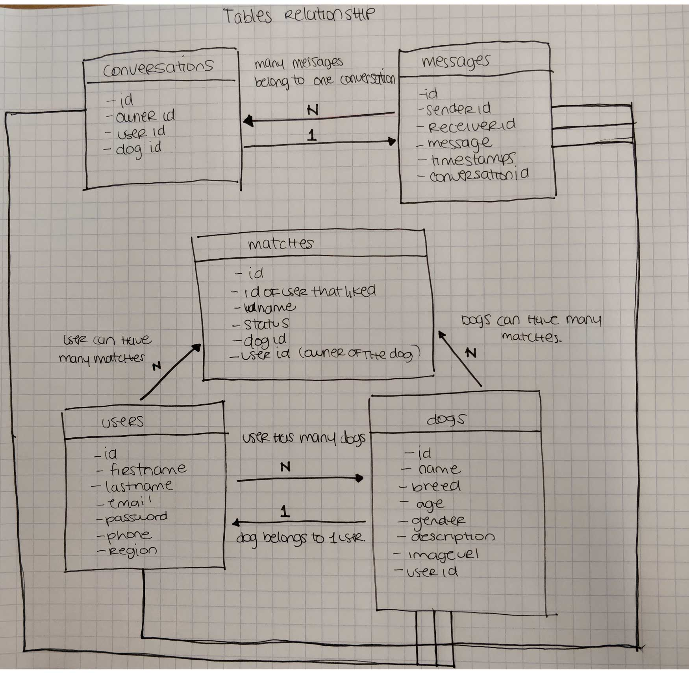

**What is the problem you are trying to solve?**

Helping dog owners find potential dog partners for the purpose of pro-creation, playdates and companionship

**Who is your target audience?**

- Dog owners in a new city
- dog breeders looking to find out what type of dogs are available around them for breeding.

**What are your specific goals?**

- Connect dog owners with the right people
- Streamlining the breeding process
- Create lifelong friendships

**What is your business model?**

- Sponsorship :

We'll give dog supply stores and services a platform to promote themselves in exchange for a small monthly fee.

**Where is your revenue coming from?**

- Subscription (monthly fee) and ads

**What are the costs of your business?**

- AWS/ S3 Bucket Server - To store our pictures
- Heroku - Deployment and hosting platform
- Godaddy - domain
- Server maintenance

**Who is your current competition?**

- [breedyourdog.com](http://breedyourdog.com/)
- <https://app.matchdog.mx>

**How is your product different from currently available competitors?**

- There isn't a specific service like this in the Netherlands
- The current competitors are focused on more of a bulletin board application (buy and sell) rather than interactive, more personal experience.

**What is the current supply / demand for your product?**

High: This is because currently there is no one place for breeders to meet and connect over breeding their dogs. This community heavily relies on chat-boards and forums still, as a mean of communications.

## Technical Specifications

**What data will you need to store?**

- Users
- Dogs
- Matches
- Conversations
- Messages

**How will it be organized?**

We store each of the previously mentioned in a table

**What does your product look like?**

List each view, their purpose, and how they work

**Pages**

1.  Login / Sign up :

The user can either create a new account or login to their current account

1.  Profile / Dashboard :

Once logged in, the user is taken to a "profile dashboard" where they can either:

_Add a new dog_ or _Browse all dogs._

1.  Add new dog:

Input fields to create the dog and upload a picture. We implemented a small AI feature using amazon rekognition to be sure people don't upload random pictures.

1.  Dog profile:

It shows details about the dog. If the user is also the owner, it will also let him to edit/ delete the dog.

1.  Browse all dogs:

Lists all the existing dogs in our database.

The user can click "match" to send a request to the owner of the user.

It is also possible to filter the dogs based on gender, breeds, age and location.

1.  Match request:

When a user is interested in a dog, they can send a match request. The owner of the dog then receives a request where he/she can either accept or reject. If accepted, then a conversation is enable, other wise, the user that requested the match gets a notification that says that the owner has rejected his request.

1.  Conversations:

It list all the ongoing conversations about a dog.

When clicking on a conversation, you can share messages with the other interested person.

**Describe any complex business logic that is happening in your application. For example, how does data flow through your application**

In order to keep a secure and friendly platform, we decided to only enable communication between dog owners if they accept the match requests.

Once a "match request is accepted" the user gets a new notification in the dashboard.

From there, they can start messaging each other and share details about their dogs.
